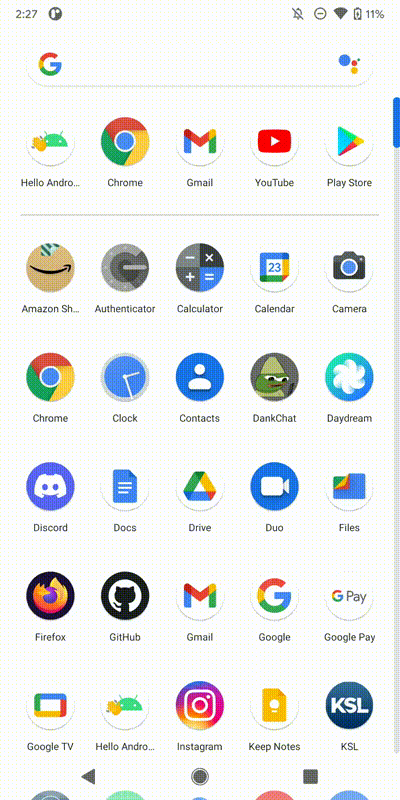

# Hello Android!

A simple Android application that will generate "Hello World!" in different formats, colors, and even a phrase other than "Hello World!"

Tested on a Google Pixel 2XL.

## Download

To install the app on your Android device, simply download [the apk file](https://drive.google.com/file/d/1eHJWnzNHWZxdoOmR3Iw1_qyk3TTESgJi/view?usp=sharing), ignore the warnings related to "untrusted sources" and allow them anyway, then install the app when prompted. Works with Android 5.0 Lollipop or newer.

## Build

You will need Android Studio to build Hello Android!, unless you understand how to use Gradle with Android projects. (I don't, so there's no instructions. Good luck!)

Simply clone the main repository with `git clone git@github.com:TheHuddle/pr-practice`, then open the directory `pr-practice/hello-world/brysonsteck` in Android Studio.
